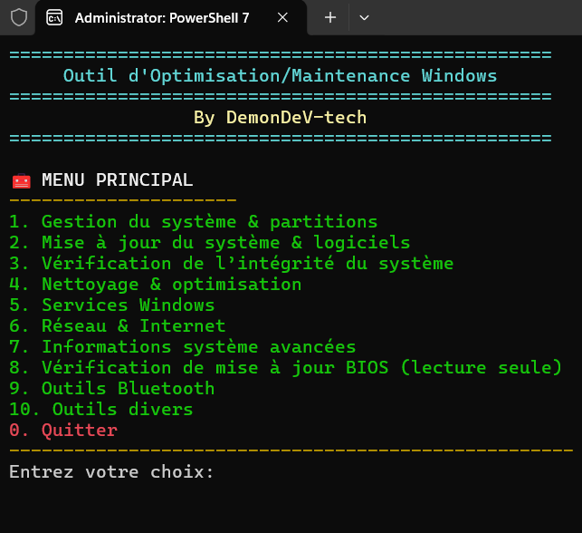

# 🛠️ Windows-Maintenance-Toolkit (WMToolkit)

**Par DemonDeV-tech**

WMToolkit est une suite d'outils avancée conçue exclusivement pour optimiser, nettoyer et réparer les systèmes Windows. Idéal pour redonner de la vitesse aux PC anciens ou saturés.

Configuration requise :
Ce toolkit nécessite PowerShell 7.0 ou une version plus récente (testé sur PowerShell 7.5).

Lien officiel PowerShell 7.5 :
<https://learn.microsoft.com/fr-fr/powershell/scripting/install/install-powershell-on-windows?view=powershell-7.5#msi>

---------------------------------------------------------

GUIDE D'INSTALLATION ET SÉCURITÉ (OBLIGATOIRE)
---------------------------------------------------------

Étape 1 : 🔓 Déblocage des scripts (Étape cruciale) Windows bloque souvent les scripts téléchargés d'Internet. Important : Faites un check complet la première fois. Même si le fichier principal semble OK, les scripts dans le dossier Modules peuvent rester verrouillés.
​Faites un CLIC DROIT sur le dossier principal du projet (ou sur chaque fichier .ps1).
​Sélectionnez Propriétés.
​Dans l'onglet Général, regardez en bas dans la section "Sécurité".
​Si la case Débloquer (ou "Unblock") apparaît, cochez-la.
​Cliquez sur Appliquer puis OK.

​[!IMPORTANT]
Vérifiez bien le fichier Start-WMToolkit.ps1 ET chaque script présent dans le dossier Modules. Si l'option "Débloquer" n'apparaît pas, c'est que les fichiers sont déjà autorisés.

​Option alternative (Méthode rapide via PowerShell) : 
Ouvrez PowerShell dans le dossier du projet et exécutez cette commande pour débloquer tous les fichiers d'un coup :

Get-ChildItem -Recurse | Unblock-File

Étape 2 : Autoriser l'exécution dans PowerShell
Ouvrez PowerShell 7 en tant qu'Administrateur et lancez cette commande :

Set-ExecutionPolicy -ExecutionPolicy RemoteSigned -Scope CurrentUser -Force

Puis pour démarrer: ./Start-WMToolkit.ps1

(Attention vérifier bien que après le 1er point là barre et coller sa arrive que sa mes un espace automatiquement donc faite attention) 
---------------------------------------------------------

📂 LISTE DES MODULES INCLUS
---------------------------------------------------------

01. Gestion Système & Partitions : Optimisation des disques et gestion des volumes.
02. Mises à jour Système : Gestion forcée de Windows Update et logiciels.
03. Intégrité Système : Analyse et réparation automatique via SFC et DISM.
04. Nettoyage & Optimisation : Nettoyage des caches, fichiers temporaires et optimisation RAM.
05. Services Windows : Gestion et désactivation des services inutiles.
06. Réseau & Internet : Réparation de la pile TCP/IP et flush DNS.
07. Infos Système Avancées : Rapports détaillés sur le matériel et l'OS.
08. Mise à jour BIOS : Lecture de version et vérification (Lecture seule).
09. Outils Bluetooth : Dépannage et gestion des périphériques sans-fil.
10. Outils Divers : Accès aux rapports msinfo32, points de restauration, gestionnaire de périphériques, réparation d'Explorer et scripts externes.

---------------------------------------------------------

💎 FOCUS SCRIPT : Fix-WindowsIndexing.ps1
---------------------------------------------------------

Inclus par défaut pour résoudre les problèmes de la barre de recherche Windows :

- Vérification : Analyse le statut du service WSearch (Running/Stopped).
- Réparation Rapide : Redémarrage forcé du service pour résoudre les blocages temporaires.
- Lancement MSDT : Ouvre l'outil de dépannage officiel Microsoft Search Diagnostic.
- Reconstruction : Suppression et recréation complète de la base Windows.edb.
- Activation : Passage automatique du service en mode de démarrage "Automatique".

---------------------------------------------------------

🛠️ UTILISATION DES SCRIPTS PERSONNALISÉS
---------------------------------------------------------

1. Placez vos fichiers .ps1 dans le dossier /scripts situé à la racine du toolkit.
2. Lancez le toolkit > 10. Outils divers > 6. Lancer un script personnalisé.
3. Bouton Rafraîchir : Si vous ajoutez un script alors que l'outil est ouvert, tapez "R" dans le menu pour mettre à jour la liste instantanément.

---------------------------------------------------------

📄 LICENCE & CRÉDITS
---------------------------------------------------------

Ce projet est distribué sous licence MIT.
Développé par DemonDeV-tech.
